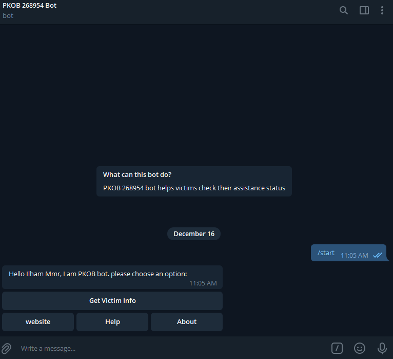
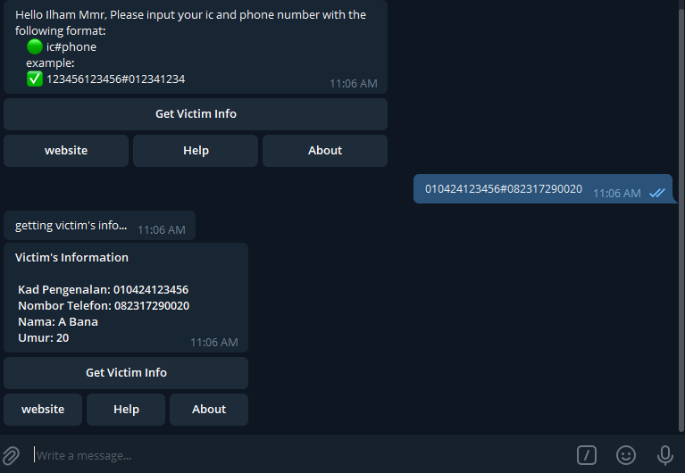
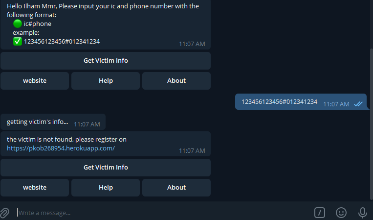

# PYTHON TELEGRAM BOT PROJECT

[Read the instruction](https://github.com/STIW3054-A211/e-sulam/blob/main/Assignment-2.md)

## Your Info

|             Name             | Matric No |
| :--------------------------: | :-------: |
| Rachmat Ilham Muslim Maulana |  268954   |

## Introduction

The Pusat Kawalan Operasi Bencana (PKOB) is a centralized mechanism that allows a district's penghulu to join disaster relief efforts right away. This method not only helps victims right away, but it also saves money by not wasting resources. The data are centralized, so the chief of village can respond faster and track down records. Furthermore, victims can apply for assistance online, saving time and effort over the traditional method.

The telegram bot helps victims get their assistance status info by keying in their required information such as ic and phone number.

## Deployment Guide

1. create an app on heroku
2. create config.py that consists of this code
   ```
   PORT = int(os.environ.get('PORT',5000))
   TOKEN = os.environ.get('TOKEN')
   ```
3. change this code updater.start_polling() to
   ```
    updater.start_webhook(listen="0.0.0.0",
                            port=int(PORT),
                            url_path=TOKEN, webhook_url="https://pkob268954bot.herokuapp.com/" + TOKEN)
   ```
4. because we get PORT and TOKEN from environment. we need to add it in heroku by going to settings then Config Vars.
5. do pip freeze > requirements.txt
6. add Procfile
   ```
   web: python3 bot.py
   ```
7. then git push heroku main
8. if there is still an error, do
   ```
   heroku ps:scale web=1
   ```

## Result/Output (Screenshot of the output)

### START



### GET VICTIM INFO (SUCCESS)



### GET VICTIM INFO (FAILED)



### WEBSITE


### HELP


### ABOUT


## Youtube Presentation

https://youtu.be/caSUQDTWauU

## List of Python packages (including the version) used for this system

The main python packages used are :

- python-telegram-bot | the telegram bot library
- requests | to do https verbs
- [requirements.txt](./requirements.txt)

## References (Not less than 10)

- Create Your Own Telegram Bot With Python. (2021). [Video]. Retrieved from https://www.youtube.com/watch?v=CNkiPN_WZfA

- GitHub - notPlasticCat/Akinator-Bot: Telegram Bot for playing the Akinator guessing game.(Unofficial). (2021). Retrieved 16 December 2021, from https://github.com/notPlasticCat/Akinator-Bot

- Heroku, D., & Nguyen, T. (2021). Deploy Python Telegram Bot to Heroku. Retrieved 16 December 2021, from https://stackoverflow.com/questions/66671569/deploy-python-telegram-bot-to-heroku

- Home · python-telegram-bot/python-telegram-bot Wiki. (2021). Retrieved 16 December 2021, from https://github.com/python-telegram-bot/python-telegram-bot/wiki

- How to Deploy a Telegram Bot using Heroku for FREE. (2021). Retrieved 16 December 2021, from https://towardsdatascience.com/how-to-deploy-a-telegram-bot-using-heroku-for-free-9436f89575d2

- https://www.youtube.com/watch?v=fQo_327-AZA. (2021). [Video]. Retrieved from https://www.youtube.com/watch?v=fQo_327-AZA

- Python Telegram bot tutorial. (2021). [Video]. Retrieved from https://www.youtube.com/watch?v=_7qf9cWlnmo

- python-telegram-bot.I already PORT 8443 but Error while bootstrap set webhook: Bad webhook: webhook can be set up only on ports 80, 88, 443 or 8443. (2021). Retrieved 16 December 2021, from https://stackoverflow.com/questions/66711302/python-telegram-bot-i-already-port-8443-but-error-while-bootstrap-set-webhook-b/67353362#67353362

- running&quot;, H., Miles, R., & Bressler, Y. (2021). H14 error in heroku - "no web processes running." Retrieved 16 December 2021, from https://stackoverflow.com/questions/41804507/h14-error-in-heroku-no-web-processes-running

- Widya Putra, D. (2021). Learn to build your first bot in Telegram with Python. Retrieved 16 December 2021, from https://www.freecodecamp.org/news/learn-to-build-your-first-bot-in-telegram-with-python-4c99526765e4/
